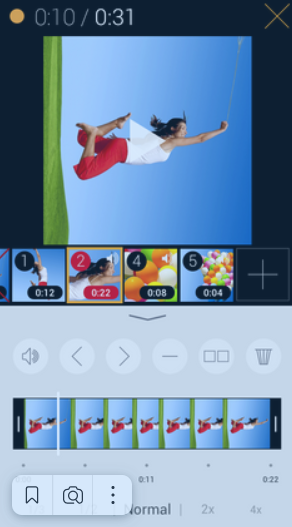
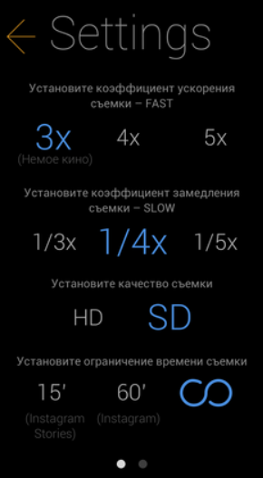
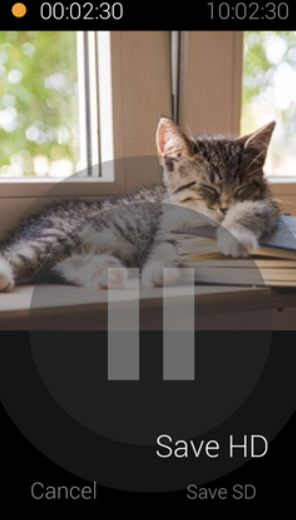

# Camillion
An application for quickly shooting videos from different pieces or fragments. it has similar functionality to TikTor and Instagram.

It is possible to shoot a video from individual pieces and combine it into one. Allows you to adjust the video resolution, shooting speed, image quality, supports dynamic zoom. You can expand the functionality by subscribing.

    
    
    
    
  

